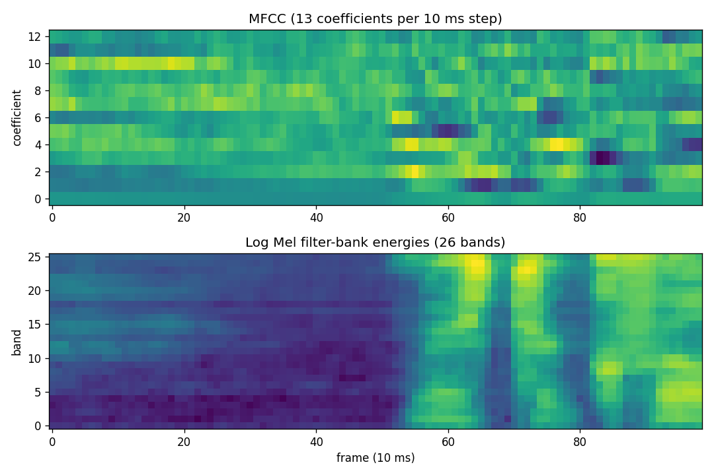

# Speaker Identification with MFCC and Gaussian Mixture Models

Closed-set speaker identification: given a short recording, decide which of *N* enrolled
speakers is talking. Each speaker is modelled by a **Gaussian Mixture Model (GMM)** fitted to
the **MFCC** frames of a few of their recordings; a new recording goes to the speaker whose
model gives its frames the highest total log-likelihood.



## Results

LibriSpeech **dev-clean** (40 speakers, 20 F / 20 M), audio resampled to 8 kHz, 13 MFCCs per
25 ms window with a 10 ms step, 7 training and 3 test recordings per speaker. Each row is five
random train/test splits (seeds 0–4); mean ± standard deviation of identification accuracy.

| Protocol | Speakers | Chance | This method (MFCC → GMM-16) | Original 2020 method |
|---|---|---|---|---|
| Train and test recordings drawn from any session | 40 | 2.5 % | **98.0 % ± 1.0** | 3.8 % ± 0.5 |
| Train on one session, test on a different session | 31 | 3.2 % | **81.1 % ± 2.9** | 6.9 % ± 2.0 |

Other runs (same splits): native 16 kHz 98.7 % ± 1.4; with cepstral mean normalisation
94.2 % ± 1.2 (any session) and 75.9 % ± 6.7 (cross-session). Raw logs are in `results/`.

**Read the first row with care.** 9 of the 40 speakers have only one recording session in
dev-clean, so in that protocol training and test audio often share microphone, room and
session — the model can partly recognise the session rather than the voice. The
cross-session row is the more honest estimate.

## How it works

1. **Features** — `python_speech_features.mfcc`: 25 ms windows, 10 ms step, 26 Mel filters,
   13 cepstral coefficients (coefficient 0 replaced by log frame energy).
2. **Enrolment** — per speaker, all frames of the training recordings are pooled and a
   16-component diagonal-covariance GMM is fitted (scikit-learn, EM).
3. **Identification** — the test recording's frames are scored under every speaker's GMM;
   the per-frame log-likelihoods are summed and the highest total wins.

## Quick start

```bash
git clone https://github.com/Moustafa-Afara/speaker-identification-mfcc-gmm.git
cd speaker-identification-mfcc-gmm
pip install -r requirements.txt

# data (not included): LibriSpeech dev-clean, 337 MB, CC BY 4.0
#   https://www.openslr.org/12  ->  dev-clean.tar.gz   (tar xzf dev-clean.tar.gz)
python speaker_id.py --data-root LibriSpeech/dev-clean                     # row 1
python speaker_id.py --data-root LibriSpeech/dev-clean --cross-session     # row 2
python speaker_id.py --data-root LibriSpeech/dev-clean --method legacy     # original method
python plot_mfcc.py LibriSpeech/dev-clean/1272/128104/1272-128104-0000.flac
```

Any corpus works if laid out as `<root>/<speaker>/.../*.wav|*.flac`. Options:
`--n-train`, `--n-test`, `--sample-rate` (0 keeps the original rate), `--cmn`, `--seeds`.

## What was wrong with the original version, and what changed

The first version (2020, uploaded 2023) is kept here as `--method legacy` so its effect can be
measured. It had four problems:

1. **Features flattened to scalars.** `mfcc(...).reshape(-1, 1)` turned each 13-dimensional
   MFCC vector into 13 unrelated numbers, so each GMM learned the distribution of individual
   coefficient values and lost the spectral shape that distinguishes voices. This alone takes
   accuracy to near chance (table above).
2. **Only the first 22 speaker models were scored** (`y=[None]*22`) although the data had 98
   speakers, and **only 2 of the 3 test files per speaker were counted** (`range(0,2)`).
3. **Per-frame majority vote** instead of the standard summed log-likelihood.
4. **The audio of a licensed corpus was committed.** The original repository contained ~980
   recordings from the TIMIT corpus, which is distributed by the LDC under a licence that does
   not allow redistribution. They were removed, together with the repository history that
   contained them; this version uses LibriSpeech (CC BY 4.0), which is downloaded separately.

## Repository

| Path | What it is |
|---|---|
| `speaker_id.py` | Enrolment, identification, evaluation (both methods, both protocols) |
| `plot_mfcc.py` | MFCC / filter-bank visualisation of one recording |
| `results/` | Logs of every run reported above |
| `docs/report_ar.pdf` | Original Arabic project report, *«التعرف على الأصوات باستخدام خوارزمية MFCC ونماذج الخليط الغاوسي GMMs»* (describes the 2020 version) |

## Credits and licence

- Code: MIT (see `LICENSE`).
- Data: LibriSpeech ASR corpus — V. Panayotov, G. Chen, D. Povey, S. Khudanpur,
  *LibriSpeech: an ASR corpus based on public domain audio books*, ICASSP 2015 — CC BY 4.0,
  https://www.openslr.org/12
- MFCC implementation: `python_speech_features` (J. Lyons).

**Author:** Moustafa Afara — signal processing and pattern recognition (audio, biosignals, vision).
